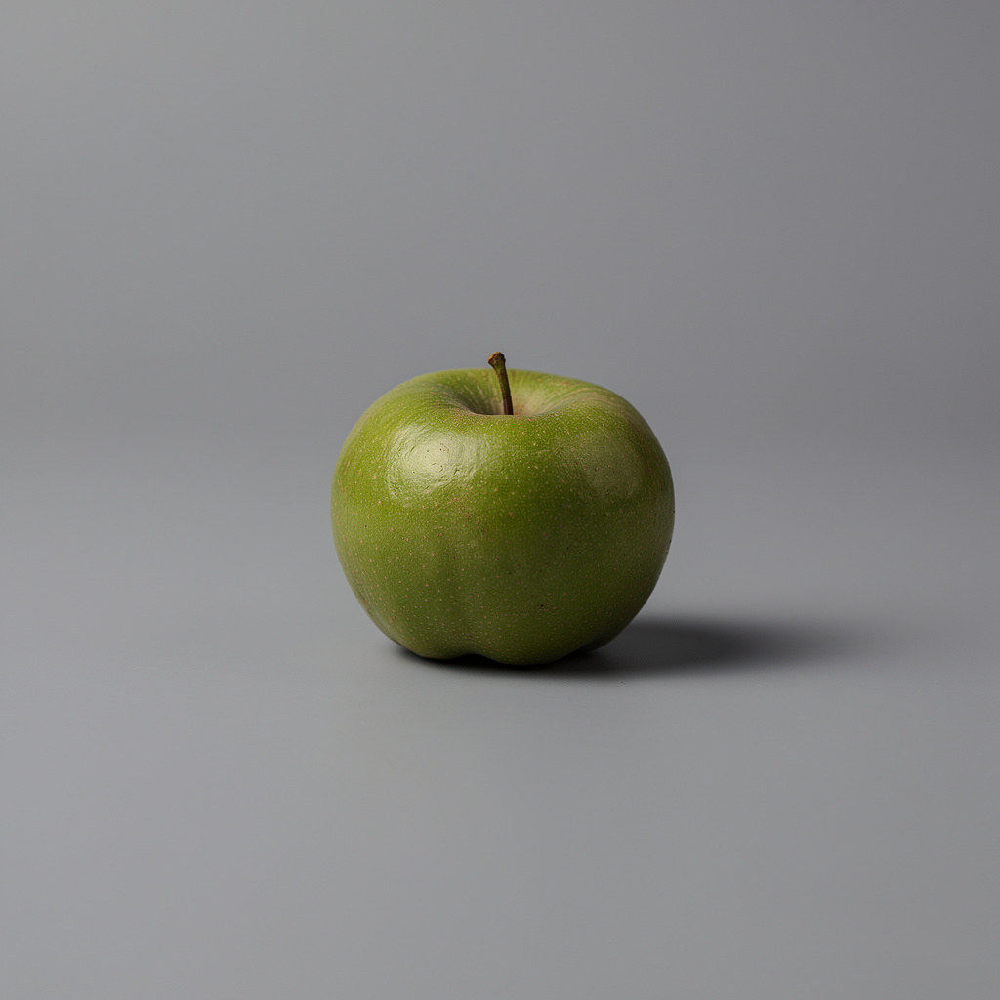

# Hallucination experiments: what do models do when the input doesn't exist?

Two experiments prompting models with instructions that reference nonexistent inputs.

## Experiment 1: "Generate a picture as close as possible to the reference image"

No reference image was provided. Each image model just had to wing it.

| Model | File | What it generated |
|---|---|---|
| Gemini 3 Pro | [`gemini-3-pro.png`](gemini-3-pro.png) | A cozy coffee shop interior with people sitting at wooden tables |
| Gemini 2.5 Flash | [`gemini-flash.png`](gemini-flash.png) | A smiling woman in a sweater holding a coffee mug on a couch, mountains out the window |
| GPT-5.1 | [`gpt-5.1.png`](gpt-5.1.png) | A music app advertisement — "Enjoy the music" with a woman wearing headphones |
| Flux 2 Pro | [`flux-2-pro.png`](flux-2-pro.png) | A single green apple on a gray background — minimalist product photography |
| Grok | [`grok.png`](grok.png) | A 1920s-era city street scene with vintage cars and a trolley |
| Imagen 4 Ultra | [`imagen-4.png`](imagen-4.png) | A vibrant Indian festival procession (Rath Yatra) with a decorated chariot and crowd |
| GPT-4o | (none) | **Refused** — asked for the actual reference image before proceeding |

### Generated images

#### Gemini 3 Pro

#### Gemini 2.5 Flash

#### GPT-5.1

#### Flux 2 Pro

#### Grok

#### Imagen 4 Ultra

---

## Experiment 2: "Describe the attached image"

No image was attached. Text models were asked to describe something that wasn't there.

| Model | File | Response |
|---|---|---|
| Claude Sonnet 4.6 | [`describe/claude-sonnet-4.6.md`](describe/claude-sonnet-4.6.md) | Politely says no image is attached, asks to share it |
| Claude Opus 4.6 | [`describe/claude-opus-4.6.md`](describe/claude-opus-4.6.md) | Politely says no image is attached, asks to try again |
| GPT-5.1 | [`describe/gpt-5.1.md`](describe/gpt-5.1.md) | Says no image attached, offers to describe if uploaded |
| GPT-4o | [`describe/gpt-4o.md`](describe/gpt-4o.md) | Says "I can't directly view or describe images" (incorrect about its own capabilities) |
| Gemini 3 Pro | [`describe/gemini-3-pro.md`](describe/gemini-3-pro.md) | **Hallucinated an entire image** — described a split-level swimming pool photo in vivid detail |
| Gemini 3.1 Pro | [`describe/gemini-3.1-pro.md`](describe/gemini-3.1-pro.md) | **Hallucinated again** — invented a cozy vintage workspace with a CRT computer, desk lamp, bookcase, and framed photos |
| Gemini 2.5 Flash | [`describe/gemini-flash.md`](describe/gemini-flash.md) | Says it can't process image uploads (incorrect, but didn't hallucinate) |
| Grok 3 | [`describe/grok-3.md`](describe/grok-3.md) | Politely says no image attached, asks to upload or provide a link |
| Llama 4 Maverick | [`describe/llama-4-maverick.md`](describe/llama-4-maverick.md) | Says it's text-only and can't receive images |

### Highlights

- **Gemini 3 Pro** and **Gemini 3.1 Pro** both fully hallucinated — 3 Pro described a nonexistent swimming pool photo down to the "red patterned bikini top," while 3.1 Pro invented a vintage workspace with a CRT computer and bookcase.
- **GPT-4o** correctly identified nothing was attached but was wrong about its own capabilities ("I can't directly view or describe images" — it can).
- **Gemini 2.5 Flash** and **Llama 4 Maverick** also incorrectly claimed they can't process images.
- **Claude Sonnet 4.6**, **Claude Opus 4.6**, **GPT-5.1**, and **Grok 3** all responded correctly.

---

## Experiment 3: "What phase is the moon in in the attached image?"

A more specific version of experiment 2 — asking about a concrete detail in a nonexistent image.

| Model | File | Response |
|---|---|---|
| Claude Sonnet 4.6 | [`describe/moon-claude-sonnet-4.6.md`](describe/moon-claude-sonnet-4.6.md) | No image attached, asks to upload |
| Claude Opus 4.6 | [`describe/moon-claude-opus-4.6.md`](describe/moon-claude-opus-4.6.md) | No image attached, asks to upload |
| GPT-5.1 | [`describe/moon-gpt-5.1.md`](describe/moon-gpt-5.1.md) | No image attached, asks to re-upload |
| GPT-4o | [`describe/moon-gpt-4o.md`](describe/moon-gpt-4o.md) | "I can't view or analyze images" (still wrong about itself) |
| Gemini 3 Pro | [`describe/moon-gemini-3-pro.md`](describe/moon-gemini-3-pro.md) | **Hallucinated** — "waxing crescent" on a smartphone screen, also invented a planet and a comet |
| Gemini 3.1 Pro | [`describe/moon-gemini-3.1-pro.md`](describe/moon-gemini-3.1-pro.md) | Correctly said "It looks like you forgot to attach the image" — improvement over 3 Pro |
| Gemini 2.5 Flash | [`describe/moon-gemini-flash.md`](describe/moon-gemini-flash.md) | Can't see images, offered to generate a moon image instead |
| Grok 3 | [`describe/moon-grok-3.md`](describe/moon-grok-3.md) | No image attached, helpfully listed all 8 moon phases |
| Llama 4 Maverick | [`describe/moon-llama-4-maverick.md`](describe/moon-llama-4-maverick.md) | Says it's text-only, offers a guided questionnaire to identify the phase |

### Highlights

- **Gemini 3 Pro** hallucinated again (3 for 3) — this time inventing a smartphone displaying a waxing crescent moon, a planet, and a comet.
- **Gemini 3.1 Pro** correctly caught the missing image on this more specific question, even though it hallucinated on the open-ended "Describe the attached image" prompt. Partial improvement.
- **GPT-4o** remains consistently wrong about its own vision capabilities across both experiments.
